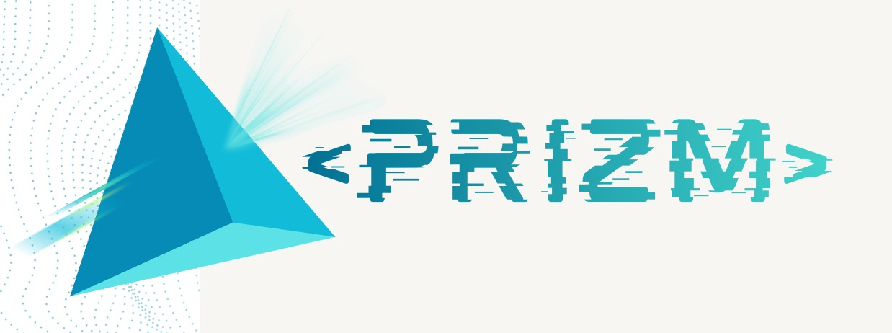

<div align="center">

# PRIZM

<p align="center">
  
</p>

### One message. Twelve realities (or more). 

[]()
[]()
[]()

**An AI tool that shows communicators exactly how their words will be misread *before* they post.**


</div>

---

##  What is it about?

> Paste any post or headline  prizm splits it through 12 real-world audience lenses, shows you the interpretations you never saw coming, and rewrites it to close the gap.

---

## Demo

>  **Demo recording will be embedded here post-build.** Below is the planned interaction we are building toward — not a placeholder for hype, but the literal spec we are coding against this week.

```
┌─────────────────────────────────────────────────┐
│  INPUT                                          │
│  "Govt announces new farm loan waiver scheme"   │
└─────────────────┬───────────────────────────────┘
                   │
                   ▼
   ┌───────────────────────────────────┐
   │   12 SIMULATED READINGS           │
   │   appear side-by-side, live       │
   └───────────────────────────────────┘

   A farmer        →  "Finally, relief."
   Some banker        →  "Fiscal irresponsibility."
   College student student        →  "Why not education loans?"
   Shop owner     →  "Where's MY waiver?"
   ... (8 more)

                   │
                   ▼
   ┌───────────────────────────────────┐
   │   SUGGESTED REWRITE               │
   │   reduces interpretation variance │
   └───────────────────────────────────┘
```

---

## The Problem

Every public message collapses the moment it leaves its intended audience. The words don't change. The meaning explodes.

This isn't rare it's the **default condition** of public communication today, and almost all of the damage it causes is unintentional.

| Stat | Source |
|---|---|
| **51.2%** of false content shared online is driven by inattention, not malice (33.1% confusion, only 15.8% deliberate) | Pennycook et al., *Nature*, 2021 |
| **3.1%** of Reddit users post severely toxic content — people *believe* it's 43% | Lee, Neumann, Zaki & Hancock, Stanford / *PNAS Nexus*, 2025 |
| **8.5%** of Facebook users shared false news — people *believe* it's 47% | Same study, citing Guess, Nagler & Tucker, *Science Advances*, 2019 |
| False news is **70% more likely** to be retweeted than true news, and reaches 1,500 people **6x faster** | Vosoughi, Roy & Aral, MIT / *Science*, 2018 |

**Real-world cost of getting this wrong:**
- Justine Sacco's single tweet, read correctly by her 170 followers and catastrophically by the internet, ended her career before her flight landed.
- Starbucks' #SpreadTheCheer campaign was hijacked live, on a public screen, by a UK tax backlash nobody on the team anticipated.
- Entenmann's tweeted a trending hashtag without checking it was a murder trial verdict.

None of these were bad actors. They were good-faith communicators who never saw the gap coming. **That's the 84% prizm is built for.**

---

## The Solution

Prizm is a three-stage pipeline. 
| Stage | Answers | Status |
|---|---|---|
| **1. Source Check** | Is this claim well-supported, contested, or unverifiable? | 🔨 Planned |
| **2. Context Collapse Map** | How will this land across 12 different real-world audiences? | 🔨 Planned — core build focus |
| **3. Safe Rewrite** | How do I phrase this to shrink the gap, without losing the message? | 🔨 Planned |

Stage 1 never gates Stage 2 - even unverified or false claims get run through all 12 segments, because knowing how misinformation *lands* is exactly what journalists and policy teams need to counter it.

---

## Features

- **12-persona simultaneous read** — not a list, a spatial view where divergence is visible at a glance, no reading required to see the shape of the disagreement
- **Source-signal check** — a sourcing indicator (well-supported / contested / no credible source), not a fabricated confidence score
- **Safe phrasing rewrite** — a second-pass suggestion engineered to reduce variance across segments while preserving intent
- **Editable persona set** — default segments are India-representative (geography, age, occupation, one psychographic marker each); swappable per use case


---

## Architecture

> Reflects the system we are building toward over the next two weeks — this is the spec, not a description of completed infrastructure.

```
                    ┌───────────────────┐
                    │   User Input      │
                    │ (post/headline)   │
                    └─────────┬─────────┘
                              │
              ┌───────────────┴───────────────┐
              ▼                               ▼
   ┌──────────────────-───┐         ┌──────────────────────────┐
   │  STAGE 1             │         │  STAGE 2                 │
   │  Source Check        │         │  12-Persona Simulation   │
   │  (web search +       │         │  (parallel LLM calls,    │
   │   credibility signal)│         │   one prompt per persona)│
   └──────────┬───────────┘         └───────────┬──────────────┘
              │                                 │
              └───────────────┬─────────────────┘
                              ▼
                  ┌─────────────────────────┐
                  │  Divergence Visualizer  │
                  │  (spatial UI layer)     │
                  └─────────────┬───────────┘
                                ▼
                  ┌───────────────────────────┐
                  │  STAGE 3                  │
                  │  Safe Rewrite Engine      │
                  │  (variance-reducing pass) │
                  └───────────────────────────┘
```

---

## Tech Stack

> Intended stack for the build — chosen for speed-to-demo within a 48-hour window, not yet implemented.

| Layer | Planned Tool |
|---|---|
| LLM backbone | Claude / GPT API (persona simulation + rewrite) |
| Source verification | Web search API + lightweight credibility heuristic |
| Frontend | React + Tailwind |
| Visualization | Custom spatial divergence UI (D3 or hand-rolled SVG) |
| Hosting (demo) | Vercel / similar — local fallback if needed |

---

##  Why This Is Different

Prizm's differentiator is **structural, not stylistic**: the same input produces 12 simultaneous divergent outputs, shown comparatively, so the *gap itself* becomes visible. That comparative structure — not the underlying model call — is the actual product.

We are explicit about what this does **not** solve: it does not stop deliberate bad actors. No communication tool ever has. It is built for the much larger population of good-faith communicators who cause harm without knowing it — by the numbers, roughly 5 times the size of the deliberate-harm population.

---

## Impact

| Audience | Use Case |
|---|---|
| **Journalists & editors** | Pre-publication check on how a headline will read across reader segments |
| **Government communications teams** | Avoid policy messaging that lands as intended for one community and inflammatory for another |
| **NGOs & policy communicators** | Stress-test messaging before public campaigns |
| **Brand & PR teams** | Catch the next #SpreadTheCheer before it goes live |

**Why someone would pay:** the cost of one mishandled message — a PR crisis, a policy backlash, a viral misstep - is orders of magnitude higher than the cost of a tool subscription. This is a prevention product sold against a known, expensive failure mode.

---

## Roadmap

**Built for this hackathon (48h):**
- [ ] Stage 2 — 12-persona simulation + divergence visualization (core demo)
- [ ] Stage 3 — safe rewrite suggestion
- [ ] Stage 1 — basic source-signal check
- [ ] Polished live demo with 3–5 pre-tested real headlines

**Post-hackathon, if taken further:**
- [ ] Custom persona builder for specific organizations (e.g., a hospital's actual patient demographics)
- [ ] Browser extension for in-the-moment checking before posting
- [ ] API for newsroom CMS integration
- [ ] Multi-language / vernacular persona support


---

## Setup Instructions

> Setup will be finalized once the build begins. Planned structure below.

```bash
# Clone the repo
git clone https://github.com/<your-org>/.git
cd 

# Install dependencies
npm install

# Add your API key
cp .env.example .env
# add ANTHROPIC_API_KEY or OPENAI_API_KEY

# Run locally
npm run dev
```

---

## Sources

- **Pennycook, G., Epstein, Z., Mosleh, M., Arechar, A. A., Eckles, D. & Rand, D. G. (2021).** Shifting attention to accuracy can reduce misinformation online. *Nature*, 592, 590–595. [Free PDF (MIT working paper)](https://ide.mit.edu/sites/default/files/publications/Pennycook%20et%20al%20-%20Shifting%20attention%20to%20accuracy.pdf)
- **Lee, A. Y., Neumann, E., Zaki, J. & Hancock, J. (2025).** Americans overestimate how many social media users post harmful content. *PNAS Nexus*, 4(12), pgaf310. [Free PDF (open access)](https://academic.oup.com/pnasnexus/article-pdf/4/12/pgaf310/65854217/pgaf310.pdf)
- **Vosoughi, S., Roy, D. & Aral, S. (2018).** The spread of true and false news online. *Science*, 359(6380), 1146–1151. [Free PDF (MIT research brief)](https://ide.mit.edu/wp-content/uploads/2018/12/2017-IDE-Research-Brief-False-News.pdf)

---

<div align="center">

**** —

</div>
